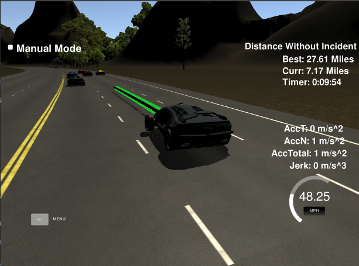
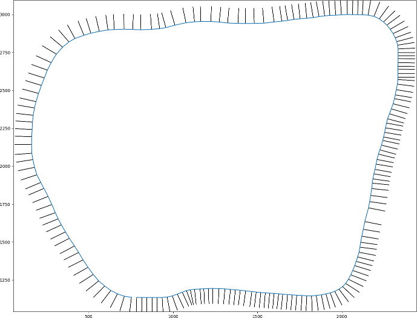

# Udacity Self Driving Car Nanodegree

## Term 2, Project 1 -- Path Planning

### Name: Ciaran Murphy

### Date: 2-July-2018

---

## Introduction

The objective of this project is to implement a Path Planning algorithm to
control a car as it drives around a track in the Udacity simulator. The car
should demonstrate the following behaviors:

* Should not crash into any other traffic on the road
* Should not drive between lanes unless changing lanes
* Should not accelerate at a rate faster than 10m/s/s
* Should stay within the 50mph speed limit
* Should be able to perform at least one full lap of the track (approx 4.3
  miles)

In this write up, I will cover the points of the project
[rubric](https://review.udacity.com/#!/rubrics/1020/view). 


## Compiling

The code can be compiled with no errors or warnings using the provided cmake
file in the project root directory. To compile, move to the root dir of the
project and execute:

```shell
mkdir build && cd build
cmake ..
make

```

This will create a file called `path_planning` which is the main executable of the program.


## Valid Trajectories

### _Requirement _: The car is able to drive at least 4.32 miles without incident.

In tests the car was easily able to drive around the full length of the track
without incident. In fact I was able to reach a personal best of 27.61 miles so
far (see screenshot below). In general the implementation is very reliable but
does still suffer from some corner cases and will occasionally fail to respond
to a very aggressive car elsewhere on the road.

<div style="text-align:center"></div>
<div/><div/>

For a full video of the car driving around the track, see here:
[YouTube](https://youtu.be/nXaARhqU-YI).

### _Requirement _: The car drives according to the speed limit

The car uses the sensor fusion data stream coming from the simulator to
determine whether or not any cars are in front of it in the current lane. If
there are no cars in front, the car accelerates at a constant rate which is
hard coded to me close to the max permitted acceleration (10m/s/s) but that
does not violate the jerk limits.

The car prefers to stay in the center lane and when it detects there is a car
in front of it, either it will change lane (if the lane to the left or right is
free) or it will decelerate until it reaches a speed that matches that of the
car in front.

See the code excerpt below from `main.cpp`:

```cpp  
// Have a reference velocity (mph) to target. This is set to zero initially
// and incrementally increased at the beginning of the simulation
double ref_vel = 0;

...

// Max acceleration and deceleration. Both are allowed to be as much as 10m/s^2
float max_acceleration = 1.7;
float max_deceleration = 1.9;
float actual_deceleration = 0;

...

// There is no car close in front, so accelerate to max velocity,
// which is 50, but we need to stay a bit below to be on the safe side.
else if (ref_vel < 48.0)
    ref_vel += max_acceleration;

```

The deceleration rate is dynamically calculated at each time step as a function
of the difference in velocity between the ego car and the leading car. The two
velocities are compared, the difference normalized to be between 0 and 1, and
then the max permissible deceleration rate is scaled down by that factor. In
this way, the rate of deceleration is a linear function of the delta between
velocities which achieves very good results. The speed converges very quickly
to the max safe speed until a lane change becomes possible so that overtaking
can take place.

```cpp
if (must_decelerate) 
{
    // When it's necessary to decelerate, chose a rate of
    // deceleration that is equal to the max allowed scaled
    // down by a factor proportional to the difference in
    // velocity of the two cars
    vel_diff = abs(front_car_speed - (car_speed*mph2mps));
    vel_diff_norm = vel_diff / front_car_speed;
    actual_deceleration = abs((vel_diff_norm * max_deceleration));
    ref_vel -= actual_deceleration;
}

```

### _Requirement _: Max acceleration and jerk are not exceeded

As noted above, the rate of acceleration and deceleration are dynamically
adjusted to ensure that thresholds are not breached.


### _Requirement _: Car does not have collisions

Collision avoidance is achieved by parsing the sensor fusion data to determine
which lanes are free and which ones are occupied. The implementation does not
perform any behavior prediction and instead hard codes a min safe distance to
the front and rear of the ego vehicle. If the sensor fusion data indicates that
there is a car in any of the 3 lanes within these safety regions, the
corresponding lane is marked as being occupied and lane change into that lane
cannot take place. If a car is detected in the lane that the ego vehicle is
currently traveling in, and there are no alternative lanes to change into (due
to additional cars being present on the road), then the speed of the ego
vehicle is adjusted to match the leading vehicle (see above) until lane change
and overtaking becomes possible.

One wrinkle in this approach is that if there is a car in the opposite lane
that is traveling close to the speed of the ego vehicle, it may result in the
state of the opposite lane toggling rapidly between free and not free. This
would result in the ego vehicle being very indecisive about which lane to drive
in, causing it to weave in and out of lanes dangerously. To mitigate this
behavior I implemented a deque data structure for each lane to track it's
history over the course of 5 time intervals. Only when this history
demonstrates stability in the lane state (free vs. not free) is a lane change
permitted.

```cpp
// Decide whether or not to change lanes, change speed or maintain current state
if (close_cars.size() > 0)
{
    bool must_decelerate = true;
    // We only need to check what to do if in lane 1 below since
    // later on, if we are in any other lane we try to get back to
    // lane 1 asap anyway. So all we need to do here is make sure
    // we don't stay trapped in lane 1 unnecessarily.
    if (lane == 1)
    {
        if ((best_of_lane_0_or_2 == 0) && (lane0_sum == 0))
        {
            // If there is a lane change already in progress don't initiate another one
            if ((car_d >= 5) && (car_d <= 7))
            {
                lane = 0;
                must_decelerate = false;
            }
        }
        else if ((best_of_lane_0_or_2 == 2) && (lane2_sum == 0))
        {
            if ((car_d >= 5) && (car_d <= 7))
            {
                lane = 2;
                must_decelerate = false;
            }
        }
    }

```

Finally, the implementation will always prefer to have the ego vehicle in the
middle lane since that provides the maximum flexibility of choice when
encountering traffic.

```cpp
// Prefer the middle lane when reasonable
if ((lane == 0 || lane == 2) && (lane1_sum == 0))
{
    // If there is a lane change already in progress don't initiate another one
    if (((car_d >= 1) && (car_d <= 3)) || ((car_d >= 9) && (car_d <= 11)))
    {
        if ((lane == 0) && ((free_space_lane0 < free_space_lane1) || (free_space_lane1 > 200)))
            lane = 1;
        else if ((lane == 2) && ((free_space_lane2 < free_space_lane1) || (free_space_lane1 > 200)))
            lane = 1;
    }
}
```

### _Requirement _: The car stays in its lane, except when changing lanes

Lane change is achieved by specifying a point in Frenet coordinates that has
a `d` value corresponding to the desired lane. The `spline.h` library is then
used to interpolate points along a smooth trajectory into that new lane. Using
this method the lane change is efficient and fast but does not violate the
acceleration or jerk limits since the way points are chosen to be sufficiently
distant from each other (since the simulator runs on a fixed update frequency,
acceleration is actually achieved by specifying the distance between path
points).

As noted above, what can cause the vehicle to remain between lanes for an
extended period is repeatedly initiating a new lane change before the last one
has completed. This behavior is mitigated by ensuring the destination lane has
been free for sometime before committing to switch to it.


### _Requirement _: The car is able to change lanes

See above.

## Reflection

### _Requirement_: There is a reflection on how to generate paths

To simplify the process of generating path points, the Frenet coordinate system
is used. This system considers the fact that in highway driving in particular,
what is of most interest is the position in the lane, which is
equivalent to the distance from the center of the road given any specified lane
width, and the total amount of road traveled. These values are denoted `d` and
`s` respectively. Using this coordinate system, one can imaging the road as
a straight line and the lane position as a point to the left or right of that
line at a right angle. Changing lane is then a simple matter of changing the
`d` value to match the desired lane. When the time comes to actuate the car,
the Frenet coordinates can easily be converted back into Cartesian coordinates,
or any other coordinate system.

The input data to the program is a csv file containing map points in Cartesian
coordinates. These map points trace out the path of the track as shown below.

<div style="text-align:center"></div><div/>

(Note that also shown in this image are the `dx` and `dx` vectors supplied in
the map data, scaled by a factor of 100. These vectors are not used in the
program.)

By combining these way points with the `(x, y, theta)` state of the car, it is
possible to compute the `s` and `d` values. This is performed in the function
`getFrenet()` in `main.cpp`:

```cpp
// Transform from Cartesian x,y coordinates to Frenet s,d coordinates
vector<double> getFrenet(double x, double y, double theta, const vector<double>
        &maps_x, const vector<double> &maps_y)

```

The procedure to perform the transformation is somewhat involved, but it
basically comes down to determining the current distance to the center line of
the track @ 90 degrees (`d`) and the total distance traveled from the start
(`s`). The distance traveled from the start is relatively easily computed by
summing all the euclidean distances between the way points traversed so far,
and adding on the distance between the last way point passed and the current
position of the car. The distance to the center of the track is a bit less
obvious. It is found by calculating the projection of the vector pointing from
the last way point passed to the ego vehicle, onto the track, and then using
that projection to calculate the right angle distance which forms the 3rd side
of a right angle triangle.

Conversion from Frenet back to Cartesian is relatively straightforward. See the
helper method `getXY()` for implementation details. Note that both these
methods were provided in the sample code for this project.

```cpp
// Transform from Frenet s,d coordinates to Cartesian x,y
vector<double> getXY(double s, double d, const vector<double> &maps_s, const
        vector<double> &maps_x, const vector<double> &maps_y)

```

Given that we can now easily convert between coordinate systems, the steps to
generate a trajectory are broadly as follows:

* If no lane change is required, simply add an increment to `s` and leave `d`
unchanged. Performing this multiple times will generate a straight path
forward. If acceleration or deceleration is needed, this can be achieved by
varying the difference between successive `s` values.

* If a lane change is needed, specify an `s` value as above, but also change
  `d` so that it corresponds to the desired lane.

* Append the generated points to the end of the trajectory from the previous
  iteration (usually the simulator will only consume about 3 points in each
  simulation loop).

* Use a line fitting algorithm to fit a smooth trajectory to the combination of
  the old points from the last trajectory and the newly added points from the
  latest calculations. For this project I am using the `spline.h` library.

* Return the new trajectory plan back to the simulator for actuation

The implementation of these steps can be seen in lines 513 to 611 in `main.cpp`

